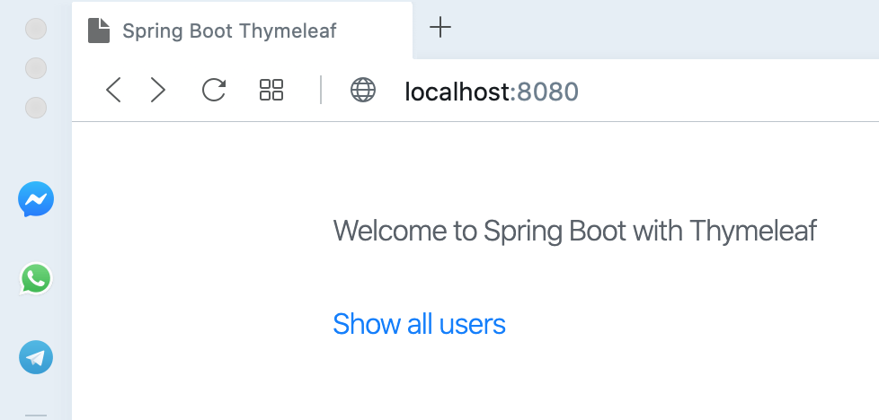
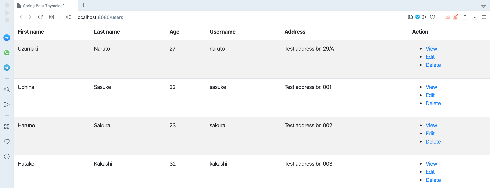

# Spring Boot Thymeleaf
Spring Boot Demo with Thymeleaf template engine.

## Before running
Make sure JDK8 nad maven already installed on your local machine.

## Running the application
1. Open terminal and navigate to project directory
2. Run command ```mvn clean install -DskipTests```
3. Run project.

## Packaging the application
1. Open terminal and navigate to project directory
2. Run command ```mvn clean package -DskipTests```
3. You can find the executable jar at target folder.
4. Run your app with command: ```java -jar <appName>.jar```

## Open Your favorite browser
**Index Page**

http://localhost:8080/



**List All Users**

http://localhost:8080/users

